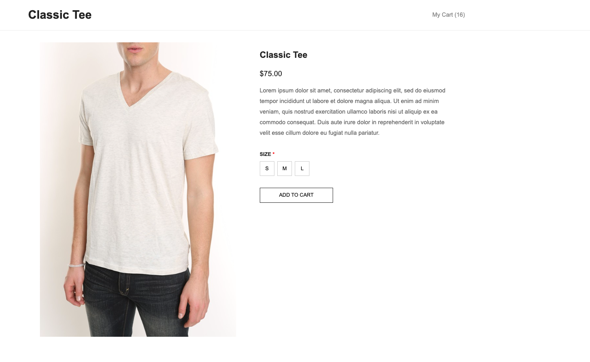
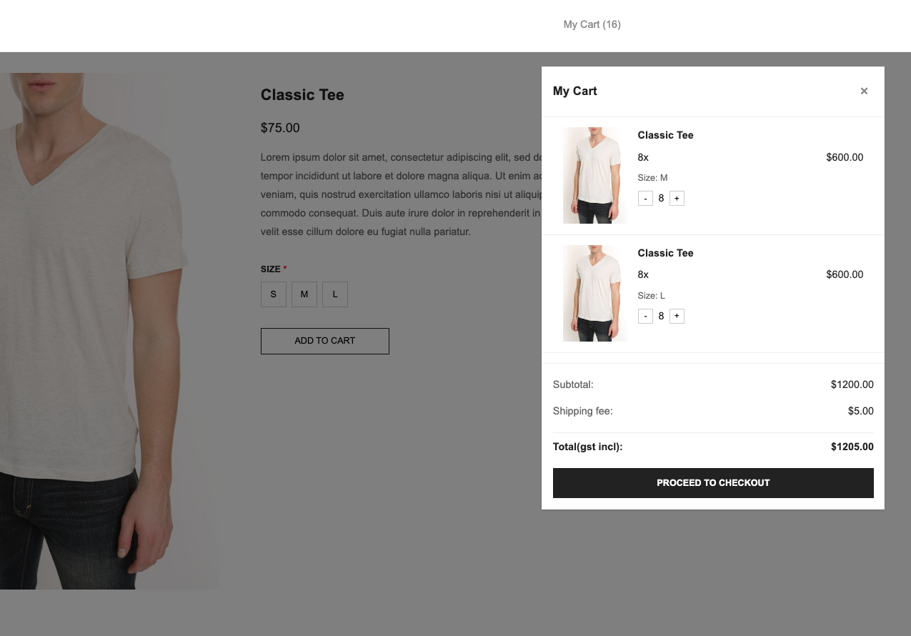

# Classic Tee Product Page

A responsive single product page built with vanilla JavaScript, HTML5, and CSS3. 




## Features

- Product display with image, title, price, and description
- Size selection
- Shopping cart functionality:
  - Add to cart
  - Update quantities
  - Remove items
  - Auto-calculate totals with shipping
- Responsive design for mobile and desktop
- Local storage for cart persistence
- API caching to handle rate limits (5 requests/hour)

## Getting Started

### Project Structure
```
clothing_web_page/
│
├── index.html              # Main HTML file
├── style.css              # All styles 
├── main.js                # Main JavaScript logic
├── cache-utility.js       # Cache handling utility
└── README.md             # This file
```

### Setup
1. Clone the repository:
```bash
git clone https://github.com/thoseJC/clothing_web_product_details
cd clothing_web_page
```

2. Open with PyCharm:
- Open PyCharm
- Go to File > Open
- Navigate to your project folder
-Click 'Open'

3. Configure PyCharm Development Server:
- Right-click on your project in the Project Explorer
- Select 'Open In > Browser'
- Choose your preferred browser

4. Alternative Method(such as VSCode):

- Right-click on index.html
- Select 'Open In Browser'
- Choose your preferred browser

## Key Features Explained

### Cart Functionality
- Shows subtotal, shipping fee ($5.00), and total
- Quantities can be adjusted with +/- buttons
- Cart state persists using localStorage

### API Caching
The `ProductCache` class handles:
- Rate limiting (5 requests per hour)
- Cache duration (12 minutes)
- Request counting
- Cache storage and retrieval

### Responsive Design
- Desktop: Side-by-side product layout with dropdown cart
- Mobile: Stacked layout with full-screen cart

## Common Issues & Solutions

1. If cart doesn't open automatically:
   - Check if the "Add to Cart" button has `id="add-to-cart"`
   - Verify event listeners in browser console

2. If images don't load:
   - Check console for API errors
   - Verify network connection

3. If cart doesn't close:
   - Ensure close button has `id="close-cart"`
   - Check event propagation in console

## Future Improvements
- Cart opens automatically when adding items
- Add checkout functionality
- Add product quantity selector
- Enhance error handling
- Add loading states
- Implement search functionality

## Development Notes

### State Management
```javascript
// Main state variables
let product = null;        // Current product data
let selectedSize = null;   // Selected size
let cart = [];            // Cart items
```

### CSS Classes
Important classes to know:
- `.mini-cart.open` - Shows the cart
- `.size-button.selected` - Selected size button
- `.cart-item` - Individual cart items

### Local Storage
Cart data persists between page refreshes:
```javascript
// Save cart
localStorage.setItem('cart', JSON.stringify(cart));

// Load cart
const savedCart = localStorage.getItem('cart');
```
